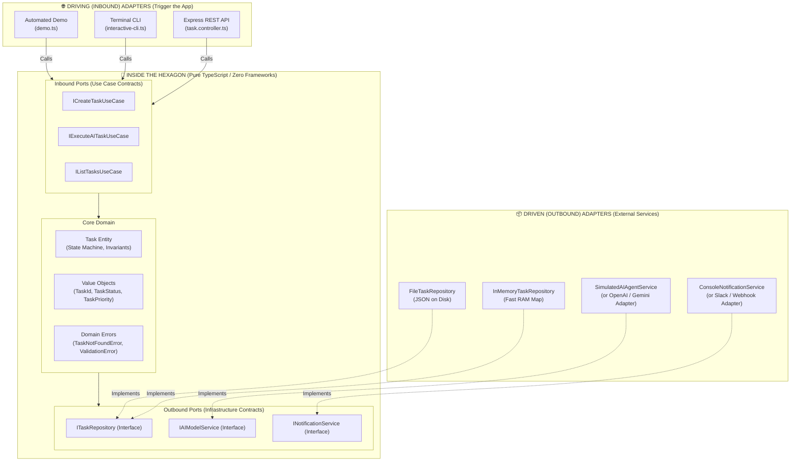

# 🔷 Hexagonal Architecture (Ports & Adapters) — Masterclass for Developers

> A clean, practical, and beginner-friendly TypeScript guide to understanding **Hexagonal Architecture** (also known as **Ports and Adapters**), designed specifically for developers building modern web backends and **AI Agent systems**.

---

## 📖 Table of Contents
1. [What is Hexagonal Architecture?](#-what-is-hexagonal-architecture)
2. [The Problem with Traditional 3-Layer Code](#-the-problem-with-traditional-3-layer-code)
3. [The "USB-C" Real-World Analogy](#-the-usb-c-real-world-analogy)
4. [Why It Matters for AI Agents & Modern Apps](#-why-it-matters-for-ai-agents--modern-apps)
5. [Architecture Diagram](#-architecture-diagram)
6. [Folder Structure & Core Concepts](#-folder-structure--core-concepts)
7. [Quick Start & How to Run](#-quick-start--how-to-run)
8. [Code Walkthrough: Step-by-Step](#-code-walkthrough-step-by-step)
9. [Hands-On Exercises to Master It](#-hands-on-exercises-to-master-it)

---

## 🧐 What is Hexagonal Architecture?

**Hexagonal Architecture** was invented by Alistair Cockburn in 2005. Its core rule is simple:

> **"Allow an application to equally be driven by users, programs, automated tests, or batch scripts, and to be developed and tested in isolation from its eventual run-time devices and databases."**

In plain English: **Your core business logic should not care what database, HTTP framework, or AI model provider you use.**

---

## 🛑 The Problem with Traditional 3-Layer Code

In traditional junior-level code (Controller ➔ Service ➔ Database), code is tightly coupled:

```
[ Express Controller ] ──> [ Task Service ] ──> [ Prisma / PostgreSQL ]
```

### Why this causes pain:
1. **Hard to Test**: To test your `Task Service`, you either have to spin up a live PostgreSQL database or spend hours setting up complex mocking libraries (`jest.mock('prisma')`).
2. **Locked into Frameworks**: Your service directly takes `req.body` from Express. If you want to trigger the same action from a CLI, a Cron job, or a WebSocket, you have to rewrite or copy-paste code.
3. **Hard to Change Technologies**: If you want to switch from Prisma to Drizzle, or from OpenAI to Google Gemini, you have to touch dozens of files inside your business logic.

---

## 🔌 The "USB-C" Real-World Analogy

Think of Hexagonal Architecture like your **laptop and its USB-C ports**:

```
                       ┌────────────────────────────────┐
                       │       YOUR LAPTOP (CORE)       │
                       │    Calculates, runs apps,      │
                       │    manages memory & logic      │
                       └───────────────┬────────────────┘
                                       │
                             [ USB-C Port (Interface) ]
                                       │
         ┌───────────────┬─────────────┴──────────────┬───────────────┐
         ▼               ▼                            ▼               ▼
     [ Mouse ]     [ Keyboard ]               [ Flash Drive ]   [ 4K Monitor ]
```

* The laptop's operating system has **ports** (contracts).
* It does **not care** whether you plug in a Logitech mouse, a Dell keyboard, or a Samsung SSD.
* As long as the device adheres to the USB-C standard (**the adapter**), it works seamlessly!

---

## 🤖 Why It Matters for AI Agents & Modern Apps

When building **AI Agents**, things change at lightning speed:
* **Models change**: Today you use `gpt-4o`, tomorrow `claude-3-7-sonnet`, next week local `ollama/llama3`.
* **Storage changes**: Today In-Memory, tomorrow SQLite, next week pgvector / PostgreSQL.
* **Triggers change**: Today REST API, tomorrow Discord Bot, CLI, or Slack Webhook.

With Hexagonal Architecture:
* You write your **AI Task Logic once**.
* You can swap the AI model adapter, the database adapter, or the user interface adapter **without changing a single line of business logic!**

---

## 🗺️ Architecture Diagram



---

## 📁 Folder Structure & Core Concepts

```
hexagonal_arch/
├── src/
│   ├── core/                      # 🛑 INSIDE THE HEXAGON (0% Frameworks, 100% Pure Logic)
│   │   ├── domain/                # Business models and rules
│   │   │   ├── entities/
│   │   │   │   └── task.entity.ts # Rich domain model with business methods (.complete, .fail)
│   │   │   ├── value-objects/     # Immutable self-validating types
│   │   │   │   ├── task-id.vo.ts
│   │   │   │   ├── task-status.vo.ts
│   │   │   │   └── task-priority.vo.ts
│   │   │   └── errors/            # Pure business errors (TaskNotFoundError, etc.)
│   │   │       └── domain-errors.ts
│   │   │
│   │   ├── ports/                 # 🔌 THE PORTS (TypeScript Interfaces)
│   │   │   ├── inbound/           # Driving Ports (What the app can DO)
│   │   │   │   ├── create-task.port.ts
│   │   │   │   ├── execute-ai-task.port.ts
│   │   │   │   ├── get-task.port.ts
│   │   │   │   ├── list-tasks.port.ts
│   │   │   │   └── dto/
│   │   │   │       └── task-response.dto.ts
│   │   │   └── outbound/          # Driven Ports (What the app NEEDS from outside)
│   │   │       ├── task-repository.port.ts
│   │   │       ├── ai-model-service.port.ts
│   │   │       └── notification-service.port.ts
│   │   │
│   │   └── use-cases/             # ⚙️ APPLICATION SERVICES (Implements Inbound Ports)
│   │       ├── create-task.use-case.ts
│   │       ├── execute-ai-task.use-case.ts
│   │       ├── get-task.use-case.ts
│   │       └── list-tasks.use-case.ts
│   │
│   ├── adapters/                  # 🔌 OUTSIDE THE HEXAGON (Adapters to the Real World)
│   │   ├── driving/               # Driving Adapters (Receive inputs from users/HTTP)
│   │   │   ├── rest-api/          # Express REST API
│   │   │   │   ├── server.ts
│   │   │   │   ├── task.controller.ts
│   │   │   │   └── task.routes.ts
│   │   │   └── cli/               # Interactive Terminal CLI
│   │   │       └── interactive-cli.ts
│   │   │
│   │   └── driven/                # Driven Adapters (Implement Outbound Ports)
│   │       ├── persistence/       # Storage implementations
│   │       │   ├── in-memory-task.repository.ts
│   │       │   └── file-task.repository.ts
│   │       ├── ai-services/       # AI Model implementations
│   │       │   └── simulated-ai-agent.service.ts
│   │       └── notifications/     # Event / Notification implementations
│   │           └── console-notification.service.ts
│   │
│   ├── container/                 # 🧩 COMPOSITION ROOT (Where all plugs meet sockets)
│   │   └── app-container.ts       # Assembles adapters and injects them into use cases
│   │
│   ├── index.ts                   # Entrypoint: Express REST API Server
│   ├── cli.ts                     # Entrypoint: Interactive Terminal CLI
│   └── demo.ts                    # Entrypoint: 1-Click Masterclass Demonstration
│
└── tests/                         # 🧪 TESTS (Shows why Hexagonal makes testing effortless)
    ├── unit/
    │   ├── domain/task.entity.spec.ts
    │   └── use-cases/create-and-execute-task.spec.ts
    └── integration/
        └── rest-api.spec.ts
```

---

## 🚀 Quick Start & How to Run

### 1. Install Dependencies
```bash
npm install
```

### 2. Run the 1-Click Automated Masterclass Demo
This script walks you through the entire lifecycle and demonstrates swapping adapters live:
```bash
npm run demo
```

### 3. Run the Interactive Terminal CLI
Experience interacting with the application directly from your console:
```bash
npm run cli
```

### 4. Run the Express REST API Server
Start the HTTP server on port 3000:
```bash
npm start
```
Test with `curl` or Postman:
```bash
# 1. Create a task
curl -X POST http://localhost:3000/api/tasks \
  -H "Content-Type: application/json" \
  -d '{"title": "Build AI Agent", "prompt": "Write a python agent script", "priority": "HIGH"}'

# 2. List all tasks
curl http://localhost:3000/api/tasks

# 3. Execute the task with AI (replace with the ID returned above)
curl -X POST http://localhost:3000/api/tasks/<TASK_ID>/execute
```

### 5. Run the Automated Tests
```bash
npm test
```

---

## 🔍 Code Walkthrough: Step-by-Step

### 1. The Domain Entity (`src/core/domain/entities/task.entity.ts`)
Notice that this file has **zero dependencies**. It doesn't import Express, Prisma, or any library. It only contains **pure business rules**:
```typescript
export class Task {
  public startExecution(modelName: string): void {
    if (!this._status.canTransitionTo(TaskStatus.RUNNING)) {
      throw new InvalidTaskStateTransitionError(...);
    }
    this._status = TaskStatus.RUNNING;
  }
}
```

### 2. The Outbound Port (`src/core/ports/outbound/task-repository.port.ts`)
Instead of importing Prisma, we define an interface:
```typescript
export interface ITaskRepository {
  save(task: Task): Promise<void>;
  findById(id: TaskId): Promise<Task | null>;
  findAll(options?: TaskFilterOptions): Promise<Task[]>;
}
```

### 3. The Use Case (`src/core/use-cases/execute-ai-task.use-case.ts`)
The Use Case receives the interfaces through its constructor (**Dependency Injection**):
```typescript
export class ExecuteAITaskUseCase implements IExecuteAITaskUseCase {
  constructor(
    private readonly taskRepo: ITaskRepository,
    private readonly aiService: IAIModelService,
    private readonly notificationService: INotificationService
  ) {}

  public async execute(command: ExecuteAITaskCommand): Promise<TaskResponseDto> {
    const task = await this.taskRepo.findById(TaskId.fromString(command.taskId));
    task.startExecution(this.aiService.getDefaultModel());
    const result = await this.aiService.generateResponse(task.prompt);
    task.complete(result.output, result.tokensUsed);
    await this.taskRepo.save(task);
    await this.notificationService.notifyTaskCompleted(task);
    return toTaskResponseDto(task);
  }
}
```

### 4. The Composition Root (`src/container/app-container.ts`)
This is where the magic happens. We instantiate the adapters and plug them into the use cases:
```typescript
const repo = new InMemoryTaskRepository(); // or new FileTaskRepository() or new PrismaTaskRepository()
const aiService = new SimulatedAIAgentService(); // or new OpenAIAgentService()
const notifService = new ConsoleNotificationService(); // or new SlackNotificationService()

const executeUseCase = new ExecuteAITaskUseCase(repo, aiService, notifService);
```

---

## 🎯 Hands-On Exercises to Master It

Try these 3 fun challenges to test your understanding:

1. **Exercise 1: Create a Discord / Slack Notification Adapter**
   - Create `src/adapters/driven/notifications/discord-notification.service.ts` implementing `INotificationService`.
   - Plug it in inside `src/container/app-container.ts`. Notice that the Use Case did not change!

2. **Exercise 2: Create an OpenAI / Anthropic AI Model Adapter**
   - Create `src/adapters/driven/ai-services/openai-agent.service.ts` implementing `IAIModelService`.
   - Call the official OpenAI SDK inside the adapter. Notice that your business logic remains 100% untouched!

3. **Exercise 3: Create a Prisma / PostgreSQL Storage Adapter**
   - Create `src/adapters/driven/persistence/prisma-task.repository.ts` implementing `ITaskRepository`.
   - Use `Task.reconstitute(...)` to map database rows into your domain entity.

---

## 💡 Summary Cheat Sheet

| Layer | Location | Role | Examples |
|---|---|---|---|
| **Domain** | Inside Hexagon | Pure business entities & invariants | `Task`, `TaskStatus`, `TaskId` |
| **Inbound Ports** | Inside Hexagon | Interfaces for Use Cases (What app can do) | `ICreateTaskUseCase`, `IExecuteAITaskUseCase` |
| **Outbound Ports** | Inside Hexagon | Interfaces for external dependencies | `ITaskRepository`, `IAIModelService` |
| **Use Cases** | Inside Hexagon | Orchestrates domain entities & outbound ports | `CreateTaskUseCase`, `ExecuteAITaskUseCase` |
| **Driving Adapters** | Outside Hexagon | Translates user input into Inbound Port calls | Express Controller, CLI, Cron Job |
| **Driven Adapters** | Outside Hexagon | Implements Outbound Ports | In-Memory Map, Prisma, OpenAI, Slack |
| **Composition Root**| Boundary | Wires adapters to ports at app startup | `AppContainer` |
